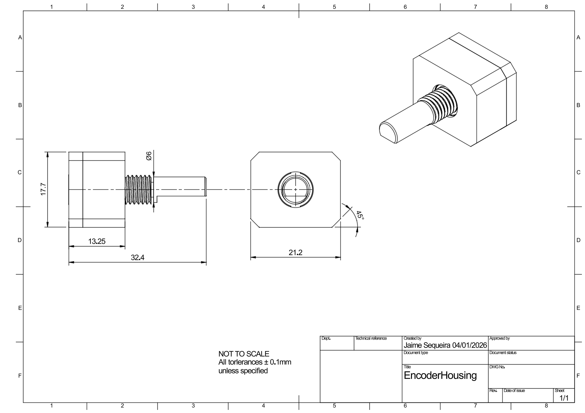
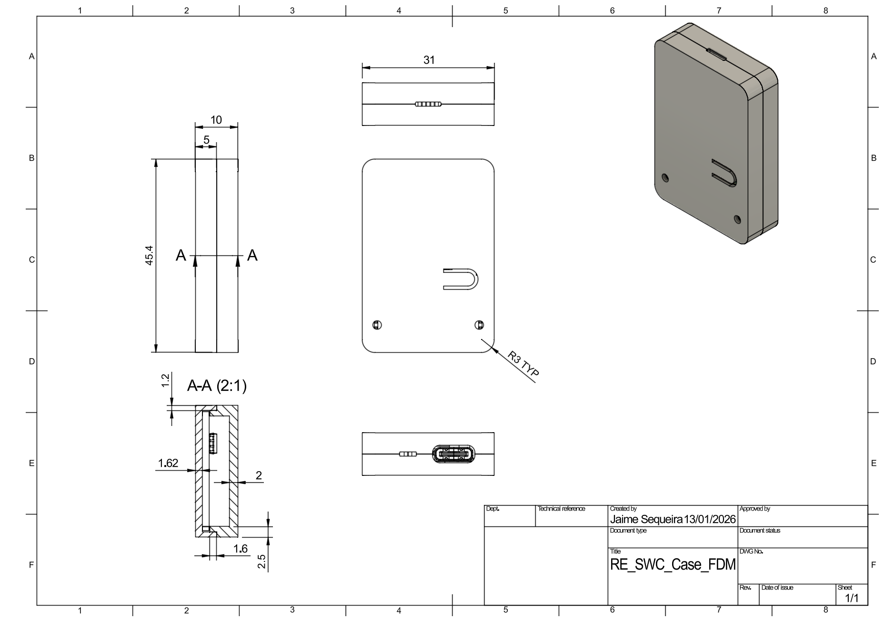
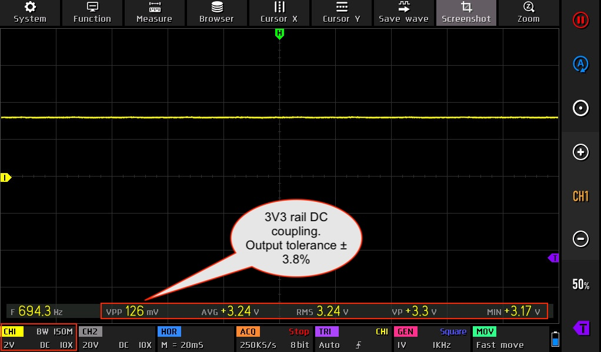
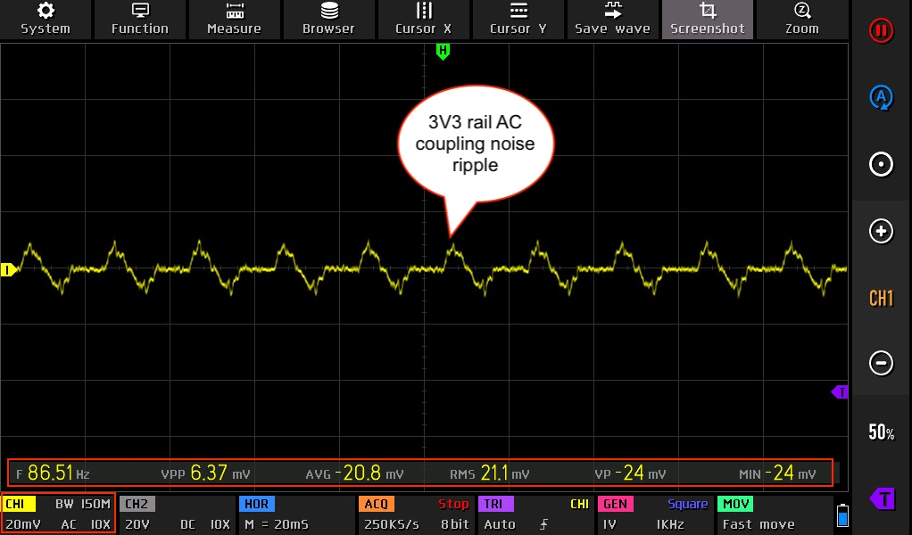
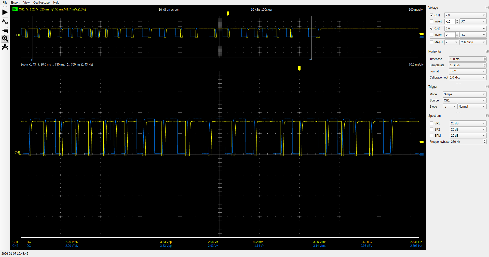
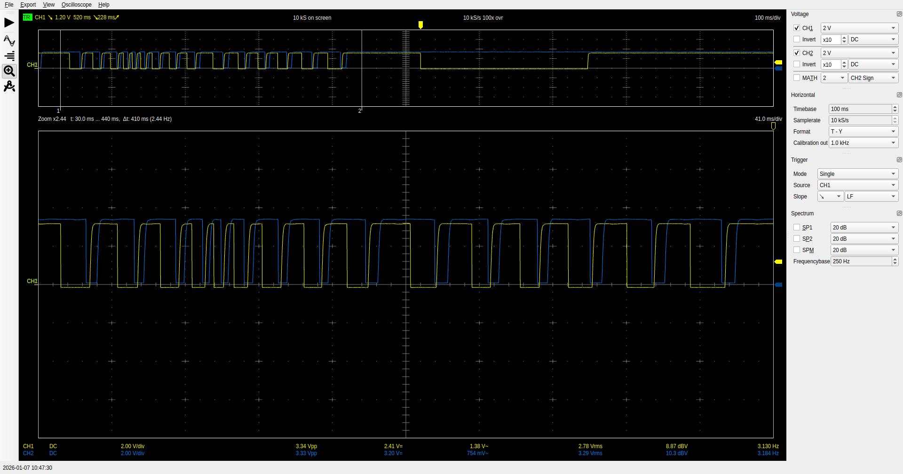
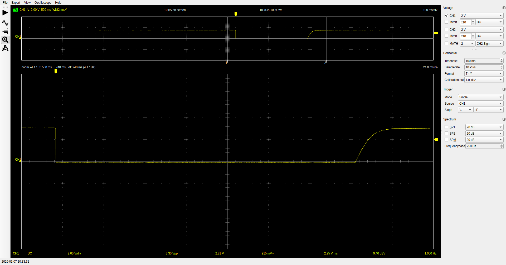
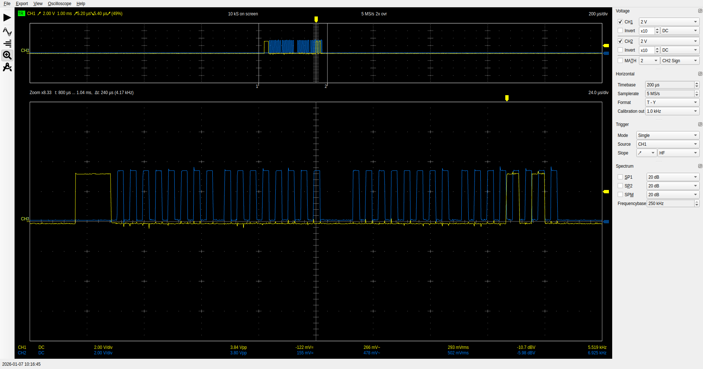
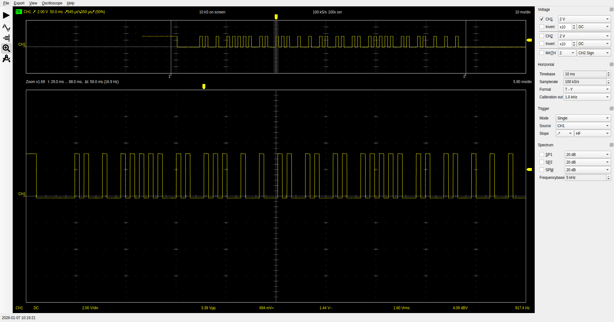

# RE_SWC - A volume knob kit for your car

### Features:

- Simple, **plug-and-play** solution. Mount the volume knob to a panel in the car, solder two wires into your stereo's steering wheel control input and you are good to go
- Compatible with many headunit brands and types
  - Generic Resistive (resistance learning supported by headunits)
  - JVC 1
  - Kenwood 2
  - Alpine
  - Pioneer & Sony
  - USB HID (single cable control for any android based units)
- **USB C powered**. Most headunits have female USB connectors for you to plug this into and power up
- MCU: WCH CH32X035 programnmed with the Arduino Framework
- Interrupt-driven firmware results in a smooth, **user-freindly** experience
- Firmware via USB upload - easy updates if required
- Fully **open source** hardware and firmware. This includes all design files, BOM, firmware, etc

1 JVC forces incremental volume control above certain values on select models. I am yet to find a way to bypass this.

2 Kenwood forces incremental volume control above certain values on select models. I have found a way to bypass this and have implemented it by default in the firmware. This may or may not work for your unit and your miles may vary.

### Functions

|        INPUT        |  GENERIC RESISTIVE  |      JVC       |    KENWOOD     |     ALPINE     | Pioneer & Sony |
| :-----------------: | :-----------------: | :------------: | :------------: | :------------: | :------------: |
|   Volume Knob CW    |         Any         |    Volume +    |    Volume +    |    Volume +    |    Volume +    |
|   Volume Knob CCW   |         Any         |    Volume -    |    Volume -    |    Volume -    |    Volume -    |
| Button Short Press  |         Any         |      Mute      |      Mute      |      Mute      |      Mute      |
|  Button Long Press  |         Any         |   Next Track   |   Next Track   |   Next Track   |   Next Track   |
| Button Double Press | Enter Learning Mode | Previous Track | Previous Track | Previous Track | Previous Track |

## User Guide

The User Guide can be found in the [Docs](Docs/) subfolder of this repository

## Firmware

The FW for this project is also completely open source and hosted [here on GitHub](https://github.com/lilindian16/RE_SWC_FW)

### Why did I make this?

- No kits like this exist: a plug-and-play solution to add a volume knob back into your car. Mount the volume knob to a panel in the car, solder two wires and you are good to go

### My headunit does not have a USB socket to power this??

No worries, purchase an automotive 12V to USB adapter and plug this into it.

- _Note: The 12V rail in cars is harsh. Do not cheap out on this component_

### FCC Compliance Statement

This device complies with Part 15 of the FCC Rules. Operation is subject to the following two conditions:

1.  This device may not cause harmful interference, and
2.  this device must accept any interference received, including interference that may cause undesired operation.

Please note, if you manufacture this yourself, FCC compliance is not valid. Pounamu Electronics is the sole manufacturer listed on the FCC SDoC.

### RESWC Impact Map

[RESWC Impact Map](https://www.google.com/maps/d/edit?mid=1JDZoqSFC2vp5jECxEuNOUrSM_snK-p8&usp=sharing)

### 3D Printed Housings - Design Files

You can find all design and production files for all housings (controller and encoder PCB) in this repo or head to thingiverse and download: [Thingiverse - RE_SWC Housings](https://www.thingiverse.com/thing:7272091)

### Volume Knob Dimensions

### Controller Housing Dimensions

### Board Bringup and O'Scope Captures

#### 3V3 Regulator

#### Encoder CW, CCW Rotation and Button Press

#### SPI Bus (Mode 0)

#### Apline SWC Output

